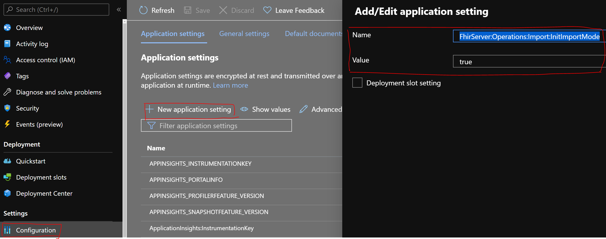
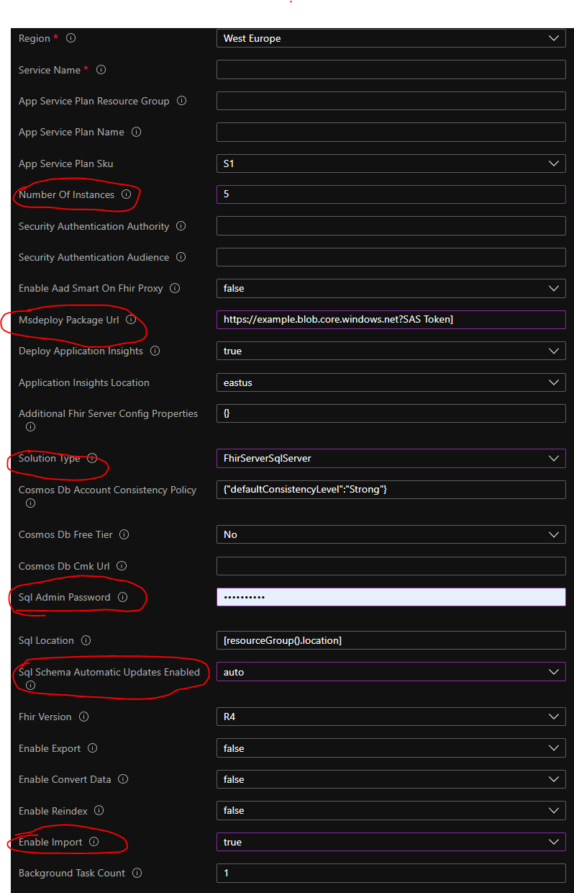

# Bulk Import

This feature allows import data to FHIR server. The feature is currently disabled by default.

## How to use $import

Follow these steps to setup and use $import API. Rest of this document details these steps.

### Prerequisites

To use $import, you need

1. A fhir server. [Deploy new fhir server](#deploy-new-fhir-server) or [Use existing fhir server](#use-existing-fhir-server) that used **Sql Server** as datastore.
1. FHIR data to be imported.

### Setps to run $import

1. **Turn on ```FhirServer:Operation:Import:InitImportMode```** After fhir-server app is ready, navigate to app service portal, click **configuration** then click **New application setting**, fill in *FhirServer:Operations:Import:InitImportMode* as _Name_ and  _true_ as value:

    
   Click **OK** then **save** the configuration, a promopt window pop up, click **Continue** to restart the app and make the change take effect.
   
   ⚠ Note when this config is set, all write requests will be blocked.
2. Make an API call in client, details in [API Call](#api-call) section.
3. Polling operation status, details in [Get Status](#get-status) section.
4. Check final status. When a status code other than 202 is returned, it means the operation has completed. The result can be divide into 3 states:
    1. ```200``` returned as status code and no error url(described in [Get Status](#get-status)) returned, means all input resources have been imported successfully.
    2. ```200``` returned as status code howerver have some error urls, means there are some unsupported or error(mistyped, duplicated...) resources, but all other resources are imported succcessfully.
    3. Non ```200``` status code returned, means some fatal errors occured during the operation processing, 
5. **Turn off ```FhirServer:Operation:Import:InitImportMode```** and restart app. Navigate to app service portal, set this to _false_ in app configuration or simply remove it. Then **save** it and restart the app, then all write requests can restore use.

## Deploy new fhir server 
Follow the guide [_QuickstartDeployPortal_](https://github.com/microsoft/fhir-server/blob/main/docs/QuickstartDeployPortal.md) to deploy a new fhir server, fill in following parameters as well as reqired ones (tagged with *):
- *Number Of Instances*: Should **> 1**.
- *Solution type*: Choose **FhirServerSqlServer**.
- *Sql Admin Password*.
- *Sql Schema automatic Updates Enabled*: Choose **auto**.
- *Enable Import*: Choose **true**.   
    
## Use existing fhir server 
### Requirements
Only sql server based fhir server can use $import, check ```FhirServer:DataStore``` setting to make sure the value is **SqlServer**, otherwise **it can't use $import**.

### Configuration
The following configuration are required, set it if different or missed:

| Configuration setting      | Required value |
| ----------- | ----------- |
| `FhirServer:Operations:Import:Enabled`      | _true_ |
| `FhirServer:TaskHosting:Enabled`      | _true_ |
`FhirServer:Operations:IntegrationDataStore:StorageAccountUri`      | Uri of _source storage account_ |

For _source storage account_, we assume that the fhir-server has permissions to read the data from this account. One way to achieve this (assuming you are running the fhir-server code in App Service with Managed Identity enabled) would be to give the App Service **Storage Blob Data Contributor** permissions for the  _source storage account_. If you don't know how to do it,  read this guide [Assign Azure roles using the Azure portal](https://docs.microsoft.com/en-us/azure/role-based-access-control/role-assignments-portal?tabs=current) for help.


## API call
Make a http call with ```POST``` method to ```<<FHIR service base URL>>/$import``` with below required headers:
| Header Name     |  Accepted values |
| ----------- | ----------- |
| Prefer | ```respond-async``` |
| ContentType | ```application/fhir+json``` |

and [Parameters](http://hl7.org/fhir/parameters.html) resource in body described below:
| Parameter Name      | Description | Card. |  Accepted values |
| ----------- | ----------- | ----------- | ----------- |
| inputFormat      | Data source format, currently must be ndjson format with each line having a valid FHIR resource. | 1..1 | ```application/fhir+ndjson``` |
| mode      | Import mode, currently only InitLoad mode is supported. | 1..1 | ```InitialLoad``` |
| input   | Details of an input file. | 1..* | A json arrary with 3 parts, described in below table. |

| Input part name   | Description | Card. |  Accepted values |
| ----------- | ----------- | ----------- | ----------- |
| type   |  Resource type of input file   | 1..1 |  A valid [FHIR resource type](https://www.hl7.org/fhir/resourcelist.html)|
| url   |  Url of input file   | 1..1 |  A valid url.|
| etag   |  Etag input file   | 0..1 |  A valid etag string.|

⚠ Notice that all resources in a file should be the same type as your provided one, mismatched resources will not be imported and recorded in error log, but will not result in overall failure.

**Sample request:**
```json
{
    "resourceType": "Parameters",
    "parameter": [
        {
            "name": "inputFormat",
            "valueString": "application/fhir+ndjson"
        },
        {
            "name": "force",
            "valueBoolean": "true"
        },
        {
            "name": "input",
            "part": [
                {
                    "name": "type",
                    "valueString": "Patient"
                },
                {
                    "name": "url",
                    "valueUri": "https://example.blob.core.windows.net/resources/Patient.ndjson"
                },
                {
                    "name": "etag",
                    "valueUri": "0x8D92A7342657F4F"
                }
            ]
        },
        {
            "name": "input",
            "part": [
                {
                    "name": "type",
                    "valueString": "CarePlan"
                },
                {
                    "name": "url",
                    "valueUri": "https://example.blob.core.windows.net/resources/CarePlan.ndjson"
                }
            ]
        }
    ]
}
```
As _$import_ is an async operation, a **_callback_** link will be returned in response's _Content-location_ header as well as ```202-Accepted``` in status code.

## Get status
Make a http call with ```Get``` method to the **_callback_** link. If the operation is still running,  ```202-Accepted``` should be returned, or if it completed successfully, ```200-Ok``` should return with details in reponse body. Some errors may occured and caused part of the reosuces import failed but didn't result in overall failure, these are recorded as files and then uploaded to the source blob, and urls are also returned in body named _url_ under corresponding file closure.

**Sample response:**
```json
{
    "transactionTime": "2021-07-16T06:46:52.3873388+00:00",
    "request": "https://importperf.azurewebsites.net/$Import",
    "output": [
        {
            "type": "Patient",
            "count": 10000,
            "inputUrl": "https://example.blob.core.windows.net/resources/Patient.ndjson"
        },
        {
            "type": "CarePlan",
            "count": 200000,
            "inputUrl": "https://example.blob.core.windows.net/resources/CarePlan.ndjson",
            "url": "https://example.blob.core.windows.net/fhirlogs/CarePlan06b88c6933a34c7c83cb18b7dd6ae3d8.ndjson"
        }
    ]
}
```

## TroubleShoot
Below are some collected errors you may encounter:

1. Sql disk exhausted 
    - Behavior: Import operation failed and [Get Status](#get-status) return ```500 Internal Server Error``` when completed, response body return this content:
        ```json
            {
            "resourceType": "OperationOutcome",
            "id": "0d0f007d-9e8e-444e-89ed-7458377d7889",
            "issue": [
                {
                    "severity": "error",
                    "code": "processing",
                    "diagnostics": "import operation failed for reason: The database 'FHIR' has reached its size quota. Partition or delete data, drop indexes, or consult the documentation for possible resolutions."
                }
            ]
            }
        ```
    - Solution: Compare your input size * 3(because we will create many indexes for input resouces, 3 times of disk size is for ensure) with [Azure SQL database storage limit](), if it is samller than that, just exapand the disk size to that level. Or if it exceed the sql limit, consider upgrade your DB tier, e.g. General purpose DB may only support 4GB max space, switch to Hyperscale if your input is bigger. 

2. conditional reference
    - Behavior: Import operation would not fail and and [Get Status](#get-status) return ```200 OK``` when completed, but error log was produced.
    - Confirm error: Open the **error log** for debugging, and search key word *Conditional reference*, if you find content like this:
        ```json
        {
            "resourceType": "OperationOutcome",
            "issue": [
                {
                    "severity": "error",
                    "details": {
                        "text": "Given conditional reference '{0}' does not resolve to a resource."
                    },
                    "diagnostics": "Failed to process resource at line: {1}"
                }
            ]
        }
        ```
    we can make sure this error occured for some resources.
    3. Solution: As *doesn't support conditional reference* is **by design**, you can only change the source file and remove or change this to a normal reference to slove the problem.
    
3. storage authentication failed
    1. Behavior: Import operation failed and [Get Status](#get-status) return ```403 Forbidden``` when completed, response body return this content:
        ```json
        {
            "resourceType": "OperationOutcome",
            "id": "bd545acc-af5d-42d5-82c3-280459125033",
            "issue": [
                {
                    "severity": "error",
                    "code": "processing",
                    "diagnostics": "import operation failed for reason: Server failed to authenticate the request. Make sure the value of Authorization header is formed correctly including the signature."
                }
            ]
        }
        ```
    2. Solution: 
        As we use managed identity for source storage auth, this may be caused by missing or wrong role assignment. To slove this, try to assign **Storage Blob Data Contributor** role to fhir server, this [guide](https://docs.microsoft.com/en-us/azure/role-based-access-control/role-assignments-portal?tabs=current) instruct you how to do this.
        
4. stortage accessability
    - Behavior: Import operation failed and [Get Status](#get-status) return ```400 Bad Request``` when completed, response body return this content:
        ```json
        {
            "resourceType": "OperationOutcome",
            "id": "13876ec9-3170-4525-87ec-9e165052d70d",
            "issue": [
                {
                    "severity": "error",
                    "code": "processing",
                    "diagnostics": "import operation failed for reason: No such host is known. (example.blob.core.windows.net:443)"
                }
            ]
        }
        ```
    - Solution: First check your link really exists(don't have typo error...), then check the network and firewall, make sure fhir server ping storage was OK. When your service was in a VNET, make sure storage was in the same VNET or in another VNET that have _peering_ with service VNET.

## Performance Best practice  
1. As we do data import in units of files, we recommend:
    - Avoid too small files(smaller than 1MB), becuase start up a new data import process have a certain overhead, too frequently bootstarp will increase the total executing time.
    - Avoid too large a single or several files, this may lead to a situation that only one or a few processes are running after most of the tasks are completed, so the overall machine utilization is low and total executing time is high. **Divide big files into small pieces** can slove this problem.
    - Increase the number of files. As different machines import different files have different speed, some machines may still starve even if the size between files are close. **Divide big files into small pieces** can also help slove this problem, and we recommend each file have size(50 ~ 500MB). 
2. Scale out to Increase parallelism, do following steps:
    1. Scale out app service plan to increase machine number. 
    2. Set ```FhirServer:Operations:Import:MaxRunningProcessingTaskCount``` in app configuration, the number of it should be your machine number + 1 or bigger.
    3. Save the configuration and restart the app.
3. Scale up
    Besides scale out, you can also scale up each machine to increase single point performance, follow the guide [ Scale Up an app](https://docs.microsoft.com/en-us/azure/app-service/manage-scale-up) to achieve this.
    In general, P3V2 machine is enough for most of the scenarios.
4. Upgrade database
    According to our experience, database is the main bottleneck of the bulk import, when you find metrics, especially **LOG IO percentage** and **CPU percentage**, is very high, you can upgrade it to imporve performance:
    - For general purpose model sql server, increase the cpu number may imporve the performance, but there is a tipping point of it, after that, only increase cpu will not improve the performance.
    - Upgrade the tier to hyperscale directly, which is much faster than general purpose sql, but you can not change back after switch to hyperscale. 
    - For general purpose model sql server, you can also increase cpu number to increase performance.
5. Turn on ```FhirServer:Operations:Import:DisableUniqueOptionalIndexesForImport``` when your input size is huge, e.g. more than 10GB.
6. Deploy all components in same region, containing _fhir-server_, _sql server database_ and _storage account_, network transmission between these shoud be fast if in one region. 


